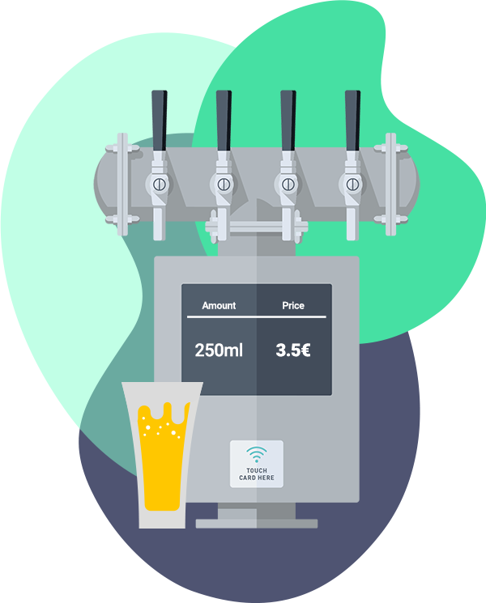

# Beer tap dispenser API

### Run

Pasos para ejecutar el projecto:

1. Clonar el projecto y situarse dentro de la carpeta api.
2. Ejecutar el comando `make run`. Se descargarn las imagenes y se crearán los contenedores para cada servicio. Web que contiene el servidor beer-dispenser-api-web, beer-dispenser-api-be para PHP, beer-dispenser-api-db para MySQL 8.
3. Una vez que los contenedores se estén ejecutando, vamos al browser a dirección http://localhost:250/api/v1/docs ya que conforme al mappeo de puertos en el fichero docker-compose mappeamos el puerto 250 del equipo local al 80 dentro del contenedor.

Si se ejecuta el comando make `fuera del contenedor`, se podrá ver la ayuda para diferentes acciones con los servicios o contedores.

    

